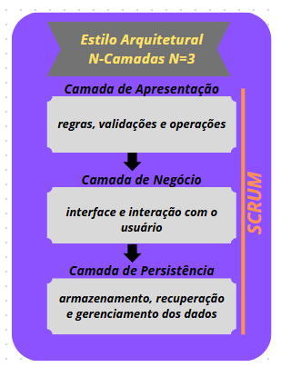

# Representação arquitetural

## Definições

O sistema seguirá a arquitetura SCRUM, onde nosso processo de desenvolvimento vai ocorrer através de sprints, com uma semana de duração cada, possibilitando flexibilidade, desenvolvimento ágil, adaptação contínua e uma entrega incremental. (Visitar tópico 2 - Visão Geral Do Produto no documento de visão para msi detalhes)

## Justifique sua Escolha

A metodologia SCRUM foi escolhida baseada na quantidade de pessoas e demanda do projeto, tendo em vista que será necessário mudanças ao decorrer do projeto e uma entrega incremental semanal, escolhemos uma metodologia com uma grande flexibilidade e que consegue atender a todos os integrantes. Isso garante a atribuição de trabalho, acompanhamento do progresso do projeto (Sprints e Dailys) e a flexibilidade desse método.

## Detalhamento

Para a construção do EcoNet, optamos por adotar uma abordagem que une um processo de desenvolvimento ágil, fundamentado na metodologia SCRUM, a uma estrutura técnica organizada em camadas N = 3(apresentação, negócio e persistência). Essa combinação garante que o projeto evolua de forma incremental e flexível, acompanhando as mudanças nos requisitos e facilitando a atribuição de tarefas, testes e entregas contínuas.

### Organização por Sprints e Flexibilidade:

- **Sprints Semanais:**
 O desenvolvimento ocorre em ciclos de 1 semana (sprints), permitindo que entregas parciais do sistema sejam avaliadas, revisadas e refinadas com base nos feedbacks recebidos. Esse ciclo curto possibilita uma resposta rápida a eventuais mudanças ou ajustes necessários, mantendo o projeto alinhado às expectativas e necessidades do produto. 
- **Atribuição de Tarefas:**
 Cada sprint tem objetivos bem definidos, com tarefas atribuídas a cada membro da equipe de acordo com suas competências. Isso torna o trabalho mais organizado, permitindo que os desenvolvedores se concentrem em partes específicas da aplicação, seja na elaboração de componentes da camada de apresentação, na definição da lógica de negócios ou na implementação dos mecanismos de persistência.

### Integração com a Estrutura Técnica do EcoNet:

**Arquitetura em Camadas:**

 Embora o SCRUM regule o processo, a implementação do EcoNet está estruturada em três camadas principais:

- **Camada de Apresentação:** Responsável pela interface e pela interação com o usuário, garantindo que todas as entradas e saídas sejam devidamente tratadas.

- **Camada de Negócio:** Focaliza a implementação das regras, validações e operações, como o processamento dos dados e fluxos internos do sistema.

- **Camada de Persistência:** Cuida do armazenamento, recuperação e gerenciamento dos dados, interagindo com o banco de dados (MySQL).
Essa divisão modular facilita a manutenção e os testes independentes de cada componente, o que se alinha perfeitamente com a filosofia de entregas incrementais do SCRUM.
### Ferramentas e Comunicação:
- **Colaboração e Feedback Contínuo:**
 Utilizamos ferramentas como o Microsoft Teams para reuniões diárias e revisão semanal do progresso (dailys, planning, review e retrospective). Isso possibilita um fluxo constante de feedback, essencial para que cada sprint seja ajustado de acordo com os desafios encontrados, assegurando a consistência e a evolução técnica do sistema.

 ### Representação Visual da Arquitetura:

 

Foi elaborado um diagrama arquitetural que ilustra a divisão em camadas, os fluxos de dados e a comunicação entre os componentes. Portanto, nosso modelo arquitetural pode ser resumido como:

**"Uma arquitetura em 3 camadas (apresentação, negócio e persistência) integrada a um processo de desenvolvimento ágil via SCRUM".**

Isso permite que cada sprint contribua para a evolução do sistema de forma incremental, com entregas parciais (e testáveis) que estão alinhadas à organização modular proposta, resultando em um sistema escalável, fácil de manter e adaptável às mudanças de requisitos.

Em resumo, a combinação do processo ágil proporcionado pelo SCRUM com uma arquitetura técnica em três camadas permite que o EcoNet se desenvolva de maneira organizada, flexível e adaptável. Cada sprint contribui incrementalmente para o produto final, refletindo ajustes constantes no design e na implementação, enquanto a divisão modular garante que os diversos componentes do sistema possam ser desenvolvidos, testados e mantidos com maior clareza e eficiência.  

# Visão Lógica

## Arquitetura em Camadas do Sistema EcoNet

A Arquitetura em Camadas adotada no sistema EcoNet organiza os módulos com funcionalidades similares em camadas horizontais distintas, abstraindo a visão do sistema como um todo e promovendo um baixo acoplamento entre seus componentes. Esta abordagem facilita a manutenção, a escalabilidade e a especialização das responsabilidades dentro do sistema. 

- **Camada de Apresentação (Frontend)**: Responsável por toda a interface com o(a) usuário(a) do EcoNet e pelas lógicas de comunicação com os navegadores. Esta camada constrói e exibe as telas de login, o painel principal com o feed de postagens de materiais, os formulários para criação e edição de anúncios de materiais disponíveis ou necessários, os perfis de empresas e as ferramentas de interação, garantindo uma experiência de usuário intuitiva e responsiva.
- **Camada de Negócios (Backend/API)**: Responsável por executar as operações e fluxos de negócios específicos associados a uma requisição vinda da camada de apresentação. No EcoNet, isso inclui validar dados de cadastro de usuários e empresas, processar a criação e o gerenciamento de postagens (anúncios de materiais), gerenciar o sistema de seguir empresas, facilitar os contatos e a formalização de contratos de reaproveitamento, aplicar regras de permissão baseadas nos papéis dos usuários e orquestrar as interações com a camada de persistência.
- **Camada de Persistência (Backend)**: Responsável por persistir ou recuperar as informações do EcoNet que são fisicamente salvas em um armazenamento. Esta camada lida com o acesso aos dados de usuários, empresas, postagens, tags, curtidas, materiais salvos, contratos e configurações do sistema, abstraindo os detalhes de como e onde esses dados são armazenados.
- **Camada do Banco de Dados (Armazenamento)**: Mantém os dados do EcoNet salvos de forma física e organizada. É onde residem as informações sobre os usuários (físicos e jurídicos), as postagens de materiais (ofertas e procuras), os relacionamentos (quem segue quem, quem curtiu o quê), os contratos firmados e todos os demais dados essenciais para o funcionamento da plataforma de reaproveitamento de materiais.

Todas estas camadas no EcoNet são projetadas para serem o mais independentes possível, formando uma abstração em torno de suas responsabilidades e do trabalho a ser realizado dentro de uma requisição específica. A comunicação entre as camadas é bem definida, permitindo que cada uma evolua sem impactar diretamente as outras, e podendo ser configurada para ser aberta ou fechada conforme as necessidades de interação e segurança estabelecidas pela equipe de desenvolvimento do EcoNet.

# Metas e Restrições Arquiteturais

- O sistema deve ser capaz de suportar múltiplos acessos simultâneos.
- O sistema deve ter vida útil prolongada, sendo capaz de evoluir tecnologicamente.
- O site precisa ser leve, responsivo e acessível, funcionando adequadamente em navegadores modernos.
- O sistema deve funcionar em rede local.
- A base de dados MySQL será nova, sem reaproveitamento de esquemas anteriores.
- O sistema deve ter segurança reforçada.
