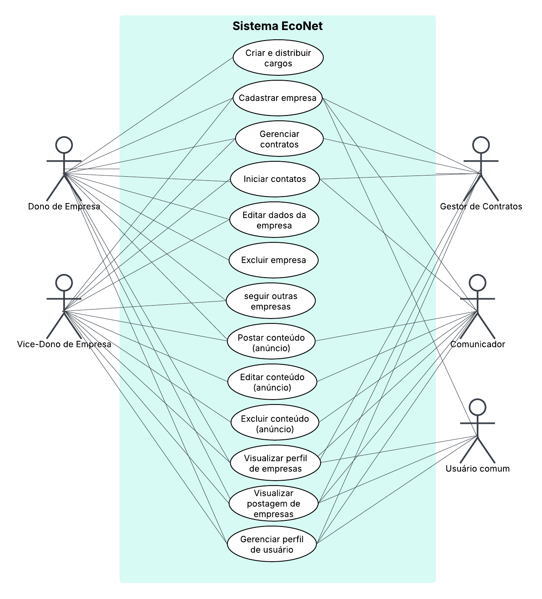
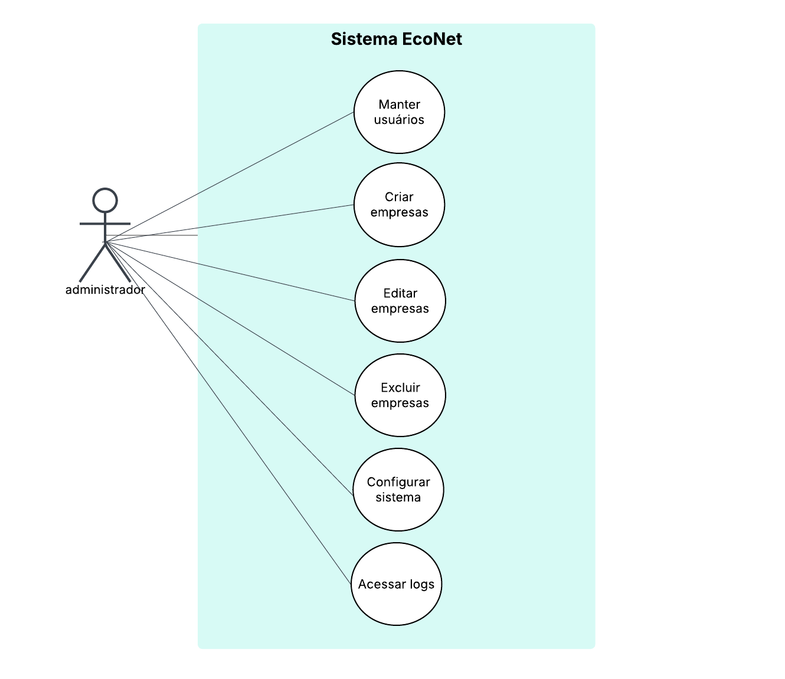

# Diagrama de caso de uso  

# Visão de Casos de Uso 

Os casos de uso do sistema **EcoNet** estão centrados na promoção de uma economia circular eficiente e segura entre empresas. O sistema possui diferentes perfis de usuários, cada um com permissões específicas, garantindo segurança e organização no uso da plataforma (Figura 2).

- **Administrador**: Responsável pela gestão técnica e completa da aplicação, podendo acessar logs, editar empresas e usuários, além de configurar o sistema.
- **Dono de Empresa**: Tem autoridade legal para editar os dados da empresa, iniciar contatos, assinar contratos e distribuir cargos.
- **Vice-Dono**: Possui as mesmas permissões do Dono de Empresa, exceto a criação/distribuição de cargos.
- **Gestor de Contratos**: Foca na formalização de acordos, sendo responsável por iniciar contatos e assinar contratos com outras empresas.
- **Comunicador**: Atua no diálogo entre empresas, sem poderes legais.
- **Visitante**: Apenas visualiza empresas e realiza buscas, sem possibilidade de interação contratual ou de contato.

Cada tipo de usuário tem acesso personalizado a funcionalidades como login, cadastro, busca por empresas, criação de contratos e chats, promovendo uma interação segura e colaborativa. O fluxo de uso da plataforma, portanto, reflete um ecossistema digital bem estruturado para facilitar a gestão de resíduos e matérias-primas reutilizáveis (Figura 3).  

  
Fonte: De autoria própria.  

Fonte: De autoria própria. 
