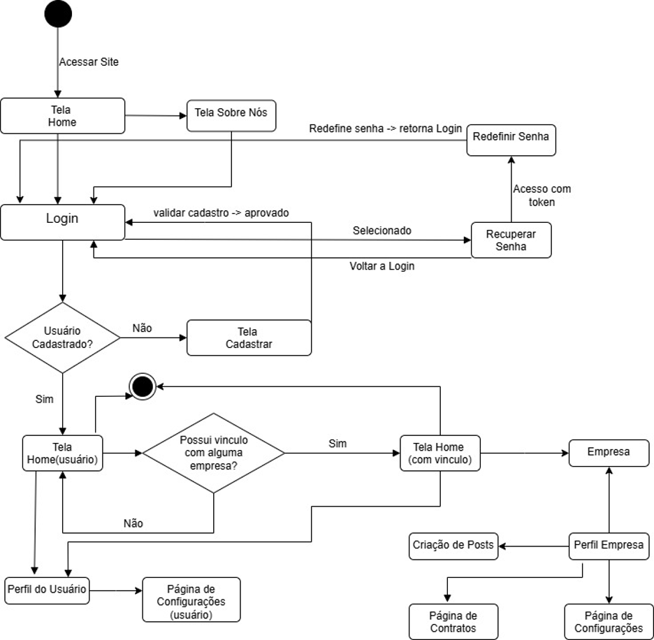

# Diagrama de estado  
Figura 4: Diagrama de estados.
 
Fonte: De autoria própria.

### **Descrição Geral do Diagrama de Estados**

O diagrama representa o fluxo de navegação de um sistema web desde o acesso inicial até as diferentes telas conforme o tipo de usuário e seu vínculo com empresas (Figura 4).

1. **Acesso Inicial:**

    - O usuário acessa o site e é direcionado para a **Tela Home**.

    - Da Home, pode ir para a **Tela Sobre Nós**, **Login**, ou recuperar a senha.

2. **Login e Cadastro:**

    - O usuário tenta fazer login.

    - Se não for cadastrado, é direcionado para a **Tela Cadastrar**.

    - Após o cadastro e validação, retorna ao login.

    - Caso esqueça a senha, pode usar **Recuperar Senha**, acessando por token e chegando até **Redefinir Senha** (e retorna ao login).

3. **Pós-Login:**

    - Se o login for bem-sucedido, verifica-se se o usuário possui vínculo com alguma empresa.

    - **Se sim:** é direcionado à **Tela Home (com vínculo)**.

    - **Se não:** vai para a **Tela Home (usuário)**.

4. **Funcionalidades pós-login:**

    - Usuários sem vínculo podem acessar:

    - **Perfil do Usuário**

    - **Página de Configurações (usuário)**

    - Usuários com vínculo podem acessar:

    - **Empresa**

    - **Perfil Empresa**

    - **Página de Configurações**

    - **Página de Contratos**

    - **Criação de Posts**

---

## Referência
### Documento de arquitetura
Para acessar a versão mais atual (v1.3.0) do documento de arquitetura, consulte o pdf  
[Documento de arquitetura - EcoNet](../../static/files/documento-de-arquitetura-algiz-2025.1.pdf)