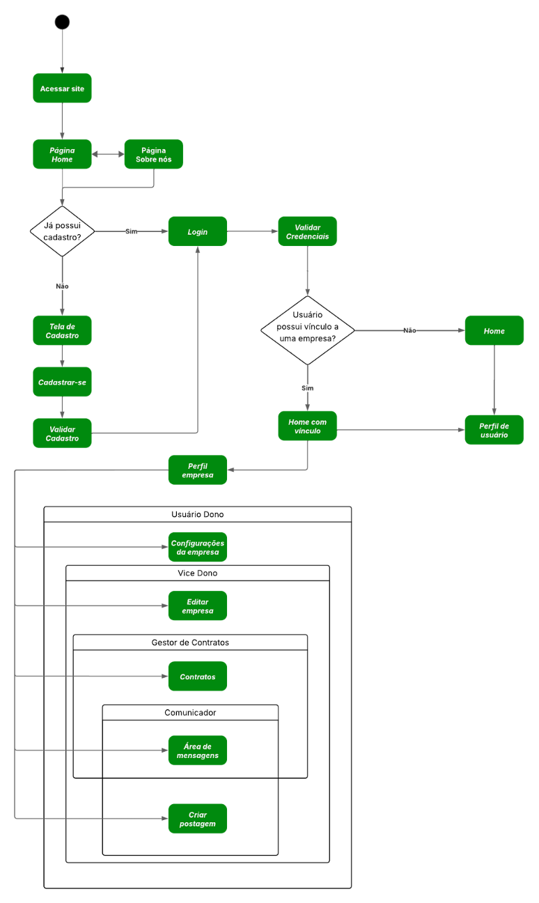

# Diagrama de atividades  

Figura 5: Diagrama de atividades

Fonte: De autoria própria

O diagrama de atividade apresentado (Figura 5) mapeia de forma clara e dinâmica o fluxo de interações de um usuário dentro do sistema web, desde o acesso inicial até a execução de funcionalidades específicas pós-login.

**Fluxo de Navegação Inicial:**

* **Acesso ao Site:**  
   O fluxo inicia com o usuário acessando o site, o que resulta na apresentação da **Página Home**. A partir desta tela inicial, o usuário pode optar por navegar para a **Página Sobre Nós** para conhecer mais informações sobre o sistema.

**Processo de Autenticação e Cadastro:**

* **Verificação de Cadastro:**  
   O sistema verifica se o usuário já possui cadastro.  
* **Usuário sem cadastro:**  
   O usuário é direcionado para a **Tela de Cadastro**, onde pode realizar a criação de uma conta. Durante este processo, é realizada a validação dos dados inseridos e verificado se o usuário deseja estabelecer um vínculo com uma empresa.  
* **Usuário com cadastro:**  
   O fluxo avança para o **login**, onde as credenciais fornecidas são validadas.

**Pós-Autenticação: Home com ou sem Vínculo:**

Após a validação das credenciais, o diagrama destaca uma nova decisão baseada no vínculo do usuário:

* **Usuário com vínculo empresarial:**  
   Caso o usuário esteja vinculado a uma empresa, ele é direcionado para a **Home com vínculo**. Nesta interface, além de acessar seu perfil pessoal, o usuário pode interagir com recursos específicos do perfil empresarial.  
* **Usuário sem vínculo:**  
   Se não houver vínculo, o usuário permanece na interface padrão, a **Home**.

**Funcionalidades Específicas do Perfil Empresarial:**

Dentro da **Home com vínculo**, o fluxo detalha as funcionalidades disponíveis conforme o tipo de perfil empresarial:

* **Usuário Dono:**  
   Possui acesso às **Configurações da empresa** para gerenciar e definir parâmetros essenciais.  
* **Vice Dono:**  
   Tem a capacidade de **Editar empresa**, permitindo atualizações e ajustes nas informações corporativas.  
* **Gestor de Contratos:**  
   Responsável pelo **Gerenciamento de Contratos**, podendo acessar e controlar os acordos firmados.  
* **Comunicador:**  
   Acessa a **Área de mensagens** e tem a permissão para **Criar postagem**, facilitando a comunicação interna e externa.
