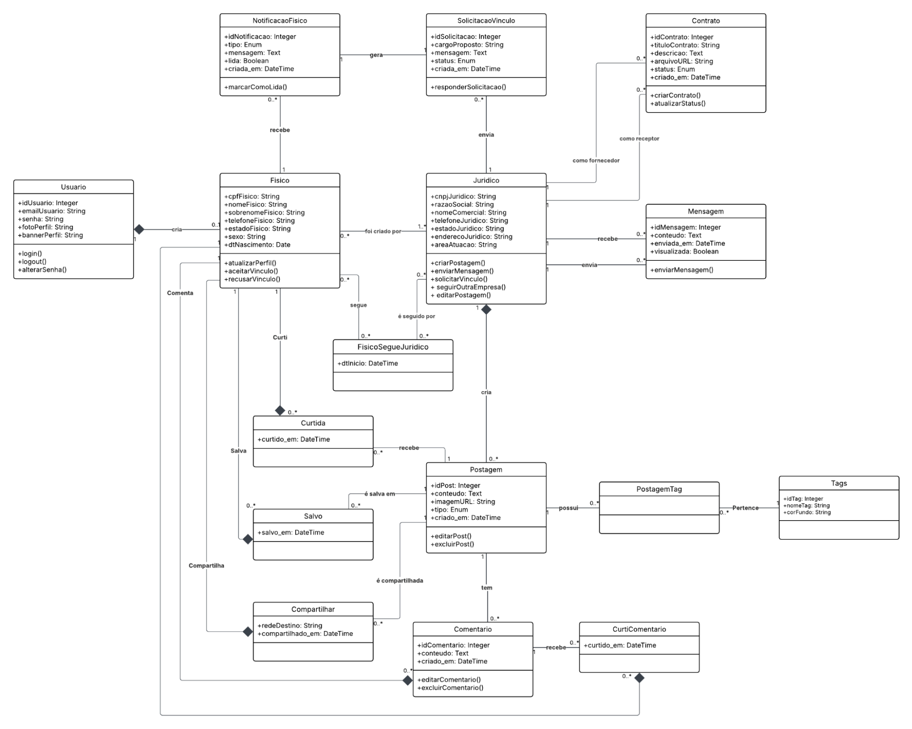

# Diagrama de classes e pacote  

# Diagrama de Classes

O diagrama ilustrado apresenta diversas classes fundamentais organizadas de forma a refletir a complexidade e a modularização do sistema. Entre as classes principais, destacam-se:

## Classes e Relações

- **Usuário:** Central para o sistema, esta classe contém atributos como idUsuario, emailUsuario, senhaUsuario, fotoPerfil e bannerPerfil, e métodos que suportam funções de autenticação e gerenciamento do perfil (por exemplo, login(), logou() e alterarSenha()).
- **Fisico:** Destinada a representar usuários com perfil individual, esta classe inclui atributos como cpfFisico, nomeFisico, sobrenomeFisico, telefoneFisico, emailFisico, sexoFisico e dtNascimento. Seus métodos, como utilizarPerfil(), aceitarVinculo() e recusarVinculo(), demonstram interações típicas de redes sociais ou sistemas colaborativos.
- **Juridico:** Voltada para contas empresariais ou institucionais, esta classe possui atributos específicos como cnpjJuridico, razaoSocial, nomeComercial, telefoneJuridico, emailJuridico, sexoJuridico, dtNascimento e areaAtuacao. Os métodos criarPostagem(), enviarMensagem(), solicitarVinculo(), seguirOutroEmpresa() e odiarPostagem() ressaltam as funcionalidades exclusivas deste tipo de perfil.
- **Postagem, Comentario e Tags:** Estas classes mapeiam os elementos de conteúdo e interação. A classe Postagem se relaciona com Comentario (permitindo avaliações e discussões) e com Tags (por meio da classe associativa PostagemTag), o que organiza e categoriza o conteúdo do sistema.
Outras classes, como NotificacaoFisico, SolicitacaoVinculo, Contrato, Mensagem, FisicoSegueJuridico, Curtida, Salvo, Compartilhar e CurtiComentario, ampliam a funcionalidade do sistema, cobrindo aspectos como notificações, vínculos entre usuários e reações diversas a conteúdos compartilhados.

## Relações e Interações
As conexões entre as classes, representadas por linhas no diagrama, indicam como os componentes do sistema interagem. Por exemplo, a associação entre a classe Usuario e Fisico demonstra a especialização ou extensão de comportamentos, enquanto a ligação entre Postagem e Salvo evidencia a funcionalidade de armazenamento ou bookmark de conteúdo. Essa rede de relacionamentos é fundamental para:
- Visualizar a dependência entre os módulos do sistema.
- Identificar pontos de integração e interface entre componentes.
- Assegurar que a implementação respeite as diretrizes da orientação a objetos, promovendo baixo acoplamento e alta coesão.

## Diagrama de pacotes
O EcoNet adota uma arquitetura baseada em três camadas principais: apresentação, negócio e persistência. Essa abordagem favorece a separação de responsabilidades, tornando o sistema mais modular e de fácil manutenção. A seguir, é apresentado um diagrama de pacotes representando as camadas do projeto e os pacotes que a compõem.

