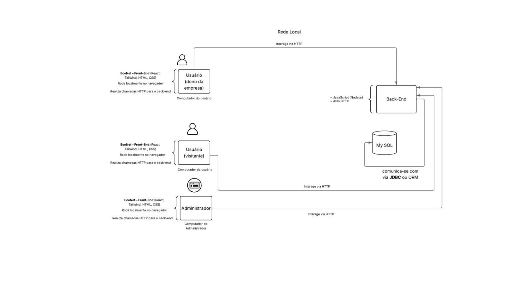
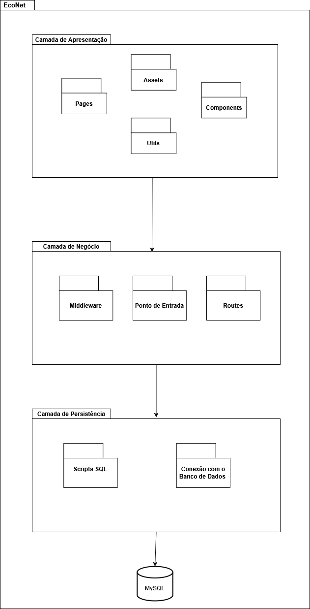
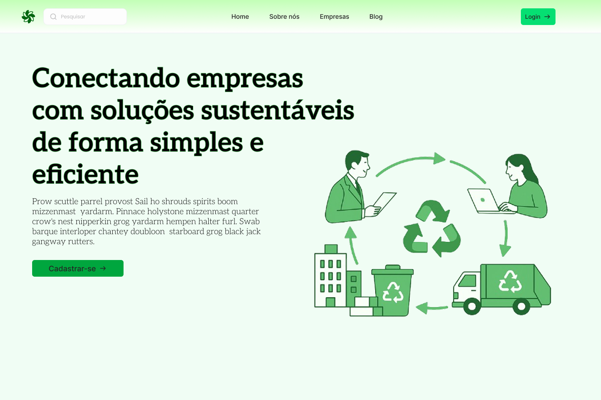
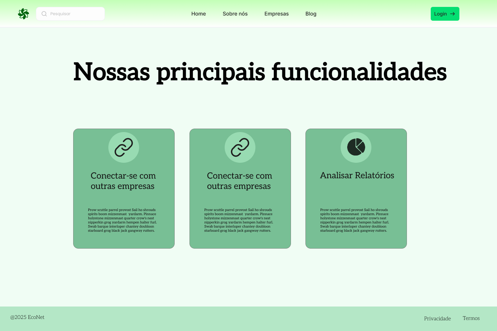
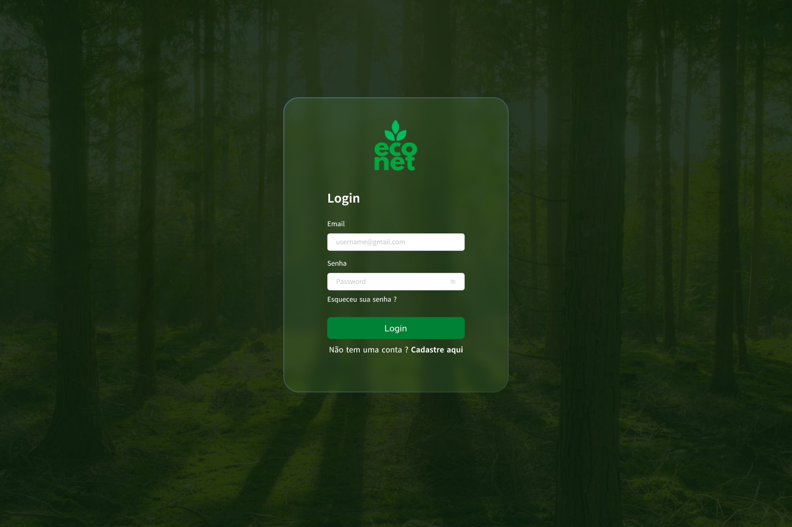
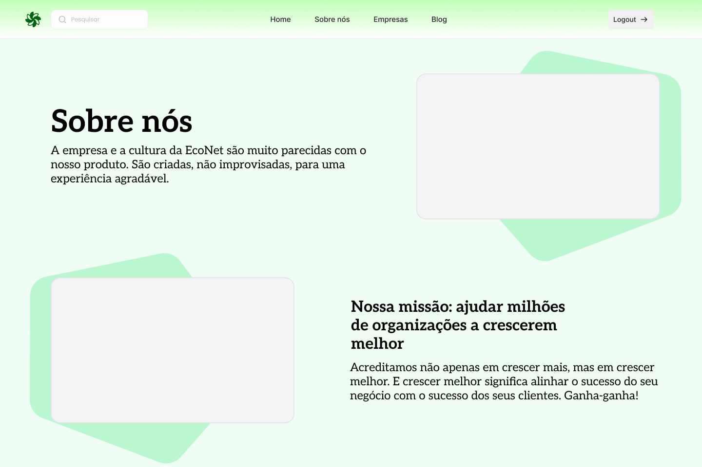

# Visao de implementação  

O EcoNet adota uma arquitetura baseada em três camadas principais: apresentação, negócio e persistência. Essa abordagem favorece a separação de responsabilidades, tornando o sistema mais modular e de fácil manutenção. A seguir, é apresentado um diagrama de pacotes representando as camadas do projeto e os pacotes que a compõem.  

  
Diagrama de Pacotes do Projeto Econet

## Camada de Apresentação
A camada de apresentação é responsável por fornecer a interface gráfica da aplicação, permitindo a interação entre os usuários e o sistema. Os pacotes desta camada concentram a estrutura de páginas e componentes visuais reutilizáveis, além de arquivos estáticos e utilitários relacionados à interface. A comunicação com as camadas inferiores se dá por meio de requisições HTTP. A seguir são apresentados alguns protótipos de baixa fidelidade desenvolvidos para representar as principais interfaces do EcoNet.

Protótipo da Página Home 

Continuação do Protótipo da Página Home 

Protótipo da Página Login  

Protótipo da Página Sobre Nós

## Camada de Negócio
A camada de negócios é o núcleo funcional da aplicação. Os pacotes desta camada são responsáveis por:
- Receber as requisições vindas da interface de usuário.
- Processar os dados conforme as regras definidas (autenticação, validação e autorização).
- Interagir com a camada de persistência para armazenar ou recuperar dados.

## Camada de Persistência
A camada de persistência tem como principal função gerenciar a comunicação com o banco de dados da aplicação. Os pacotes desta camada realizam:
- Conexão com o banco de dados.
- Execução de instruções SQL.
- Operações de leitura, inserção, atualização e exclusão de dados.
- Fornecimento dos dados necessários para a camada de negócios.
