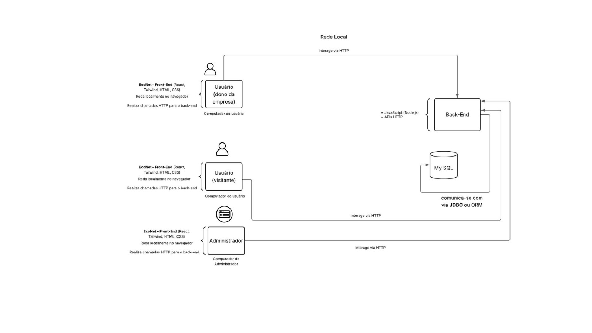
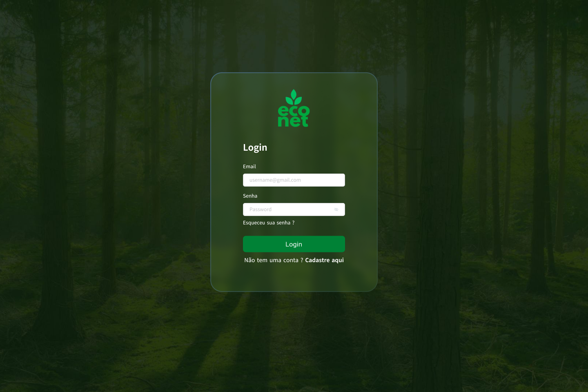

# Visao de implementação  
Figura 7: Desenho esquemático da visão de implementação.

Fonte: De autoria própria.

O Desenho esquemático (Figura 7) apresenta uma visão da implementação do **EcoNet** em rede local. Os principais elementos são:

### Perfis de Usuários
Cada perfil é representado por um ícone de computador:

- **Dono de Empresa**
- **Visitante**
- **Administrador**

### Interface de Usuário (Front-End)
- Construída com **React**, **Material-UI** e **CSS**
- Indicada como camada de apresentação
- Realiza requisições **HTTP** ao back-end

### Back-End
- Implementado em **Node.js**
- Expõe **APIs REST** para tratar as requisições vindas do front-end

### Persistência de Dados
- Utiliza banco de dados **MySQL**
- Acesso via **JDBC** ou **ORM** pelo back-end

### Fluxo de Comunicação
- Setas direcionais representam:
  - Comunicação **HTTP** do front-end para as APIs REST
  - Acesso ao banco de dados pelo back-end

### Arquitetura em Camadas
A separação clara de camadas reforça:

- Isolamento de responsabilidades
- Facilidade de manutenção
- Escalabilidade
- Segurança da aplicação

O EcoNet adota uma arquitetura baseada em três camadas principais: apresentação, negócio e persistência. Essa abordagem favorece a separação de responsabilidades, tornando o sistema mais modular e de fácil manutenção. A seguir, é apresentado um diagrama de pacotes (Figura 08) representando as camadas do projeto e os pacotes que a compõem.  

Figura 8: Diagrama de Pacotes do Projeto Econet
  
Fonte: De autoria própria.

## Camada de Apresentação
A camada de apresentação é responsável por fornecer a interface gráfica da aplicação, permitindo a interação entre os usuários e o sistema. Os pacotes desta camada concentram a estrutura de páginas e componentes visuais reutilizáveis, além de arquivos estáticos e utilitários relacionados à interface. A comunicação com as camadas inferiores se dá por meio de requisições HTTP. A seguir são apresentados alguns protótipos de baixa fidelidade (Figura 9),(Figura 10),(Figura 11) e (Figura 12), desenvolvidos para representar as principais interfaces do EcoNet.

Figura  9: Protótipo da Página Home.

Fonte: De autoria própria.

Figura 10: Continuação do Protótipo da Página Home.

Fonte: De autoria própria.

Figura 11: Protótipo da Página Login.

 Fonte: De autoria própria.

Figura 12: Protótipo da Página Sobre Nós.

Fonte: De autoria própria.

## Camada de Negócio
A camada de negócios é o núcleo funcional da aplicação. Os pacotes desta camada são responsáveis por receber as requisições vindas da interface de usuário, processar os dados conforme as regras definidas (como autenticação, validação e autorização) e interagir com a camada de persistência para armazenar ou recuperar dados.

## Camada de Persistência
A camada de persistência tem como principal função gerenciar a comunicação com o banco de dados da aplicação. Os pacotes desta camada realizam a conexão com o banco, executam instruções SQL e fornecem à camada de negócios os dados necessários para o funcionamento da aplicação. São incluídas aqui as operações de leitura, inserção, atualização e exclusão de dados.

---

## Referência
### Documento de arquitetura
Para acessar a versão mais atual (v1.3.0) do documento de arquitetura, consulte o pdf  
[Documento de arquitetura - EcoNet](../../static/files/documento-de-arquitetura-algiz-2025.1.pdf)