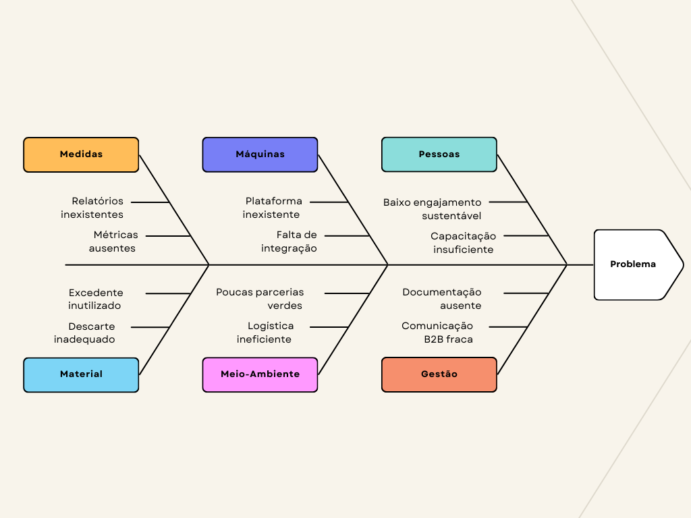

# Visão geral do produto

## Problema

- **Contexto:** O problema se insere em um cenário empresarial voltado à sustentabilidade, no qual muitas organizações enfrentam dificuldades para descartar resíduos ou excedentes de matéria-prima de forma adequada. Paralelamente, outras empresas buscam insumos sustentáveis e de baixo custo. A falta de canais eficazes de conexão entre esses atores resulta em desperdício e ineficiência. Nesse contexto, uma solução tecnológica que promova a economia circular e facilite a interação entre empresas com interesses complementares torna-se estratégica e necessária. O produto proposto será essencial para viabilizar uma relação de benefício mútuo entre as empresas, onde serão reutilizados todo o tipo de matéria-prima. Esse contexto está relacionado com os Objetivos de Desenvolvimento Sustentável (ODS) um conjunto de 17 metas globais estabelecidas pela ONU em 2015 como parte da Agenda 2030, mais especificamente o 12.6 que diz: “Incentivar as empresas, especialmente as empresas grandes e transnacionais, a adotar práticas sustentáveis e a integrar informações de sustentabilidade em seu ciclo de relatórios".

- **Problema:** O problema identificado refere-se ao desperdício de matéria-prima e resíduos que ocorre em empresas que não possuem destino útil para esses materiais. Atualmente, há pouca comunicação entre essas empresas e outras que poderiam utilizar tais recursos em seus processos produtivos. Um exemplo prático é o do Restaurante Universitário (RU), que gera grande quantidade de resíduos orgânicos e necessita de uma parceria com empresas responsáveis por coleta e compostagem apropriadas. A inexistência de uma plataforma que centralize essas oportunidades de troca e reuso de recursos agrava o problema, impedindo a adoção de soluções sustentáveis em larga escala.

- **Solução de Software:** A solução proposta pelo grupo Algiz consiste no desenvolvimento de uma plataforma web, onde empresas poderão se cadastrar e dentro do sistema atuar como fornecedoras e até mesmo demandantes de materiais reaproveitáveis. A plataforma permitirá que essas organizações estabeleçam conexões e negociem parcerias, não contando apenas com isso a plataforma também permitirá o gerenciamento de  contratos, tudo dentro de um ambiente controlado e seguro.
Além da intermediação, o sistema contará com funcionalidades para auxiliar na parte contratual  e no monitoramento das interações realizadas. Isso tornará mais fácil a interação das empresas, fomentando práticas transparentes e sustentáveis.
Espera-se, com isso, reduzir o desperdício industrial, incentivar a economia circular e fortalecer o compromisso das empresas com práticas ambientalmente responsáveis, contribuindo para um modelo de produção mais consciente e colaborativo . Como citado na ODS 12.6 “Incentivar as empresas, especialmente as empresas grandes e transnacionais, a adotar práticas sustentáveis e a integrar informações de sustentabilidade em seu ciclo de relatórios ".

- **Diagrama de Ishikawa do EcoNet:** O Diagrama de Ishikawa, também conhecido como espinha de peixe, é uma ferramenta de análise de causa e efeito que organiza, em formato de ramificações, as possíveis origens de um problema. Cada “espinha” principal representa uma categoria de causa, tradicionalmente agrupada nos chamados 6M’s: Medidas, Máquinas, Pessoas, Material, Meio-Ambiente e Gestão.

    Através dessa estrutura, é possível mapear sistematicamente variáveis que impactam o problema central, permitindo uma análise aprofundada das causas raízes que dificultam o sucesso do projeto.
    No contexto do projeto EcoNet, o Diagrama de Ishikawa foi utilizado para representar os principais fatores que contribuem para o desperdício de matéria-prima e a baixa adoção de práticas sustentáveis entre as empresas. A seguir, a [Figura 1](#figura-1) apresenta a visualização desses fatores distribuídos nas seis categorias principais.
    
    *Figura 1: Representação do Diagrama de Ishikawa para identificar possíveis problemas que o software se propõe a resolver.*
    
    *Fonte: De autoria própria.*

- **Problema central (cabeça do peixe):** Desperdício de matéria-prima não redirecionada e baixa eficiência na adoção de práticas sustentáveis pelas empresas parceiras.
- **Ramos principais (6 M's):** Cada ramo reúne um conjunto de fatores que — caso não tratados — geram o desperdício e/ou a pouca circularidade. A seguir, apresentamos os ramos e alguns sub ramos.
    - **Medidas:** Relatório Inexistentes, métricas Ausentes
    - **Máquinas:** Plataforma Inexistente, falta de Integração
    - **Pessoas:** Baixo engajamento sustentável, capacitação Insuficiente
    - **Material:** Excedente inutilizado, descarte Inadequado
    - **Meio-Ambiente:** Poucas Parcerias Verdes, logística Ineficiente
    - **Gestão:** Documentação Ausente, documentação B2B Fraca

## Declaração de Posição do Produto

- **Declaração de Posição do Produto:** O produto que estamos desenvolvendo é um website interativo que permite o cadastro de empresas e gerenciamento de contratos, facilitando a comunicação direta entre elas para a reutilização de materiais e também sendo responsável pelo armazenamento de contratos entre as empresas. O site possibilita que empresas se conectem para firmar parcerias, onde uma empresa atua como fornecedora e a outra como consumidora, criando um ciclo sustentável de reaproveitamento de matéria-prima. As empresas poderão registrar materiais/matérias-primas e buscar outros fornecedores ou consumidores por meio de filtros de pesquisa. Além disso, teremos uma funcionalidade de gerenciamento de contratos, onde as empresas iriam guardar não apenas os contratos mas as informações do contratante e do contratado, sendo esses documentos armazenados no próprio site. 
O diferencial do nosso produto é a capacidade de conectar empresas que produzem materiais em  excesso com aquelas que buscam uma forma mais sustentável e econômica de obter matéria-prima. Também, auxiliando no gerenciamento de contratos e armazenamento dos mesmos, evitando desorganização e perda de informações. Com um grande número de empresas cadastradas, o sistema amplia as opções para reutilização, promovendo a sustentabilidade e reduzindo desperdícios.
O público-alvo do produto são empresas que têm materiais excedentes que precisam ser descartados e aquelas que buscam uma alternativa mais barata e sustentável para suprir suas necessidades de produção. Esse produto é importante para essas empresas porque oferece uma solução eficaz e econômica para evitar o descarte de materiais e para a compra de matéria-prima, resultando em uma redução de custos, aumento da sustentabilidade e, consequentemente, aumento nos lucros.
O upload de contratos dentro do próprio site é uma funcionalidade para facilitar a organização das empresas, com uma área especificamente relacionada aos contratos. Esse serviço vai ocorrer dentro de uma página do site, uma funcionalidade que envolve armazenar os dados previamente cadastrados tanto do contratante como do contratado, além de ter um campo direcionado ao upload de contratos, deixando o processo mais organizado e de fácil acesso, já que estarão armazenados em uma parte específica da nossa aplicação. 
A seguir, a [Tabela 4](#tabela-4) (Declaração de posição do produto) apresenta uma declaração de posição do produto, sintetizando de forma estruturada os principais elementos: público-alvo, necessidades atendidas, proposta de valor, diferenciais competitivos e comparação com soluções tradicionais.

*Tabela 4: Declaração de posição do produto*
| Categoria               | Descrição                                                                                                                                                                                                                                                                                                                                 |
|-------------------------|-------------------------------------------------------------------------------------------------------------------------------------------------------------------------------------------------------------------------------------------------------------------------------------------------------------------------------------------|
| **Para**                | Emprestar que precisam descartar matéria-prima excedente, traduzir ou subprodutos industriais e empresas que buscam fontes alternativas e sustentáveis de matéria-prima ou insumos. Além disso, também é um incentivo para corporações que almejam aumentar a organização de dados.                                                       |
| **Necessidade**         | Uma plataforma que promova a comunicação eficiente e segura entre quem deseja descartar de forma consciente e sustentável e quem precisa de materiais para produção, fornecendo práticas de economia circular que também armazena documentos e facilita a interação burocrática entre as corporações.                                      |
| **O ResNet**            | É uma aplicação web, que conecta empresas com objetivos sustentáveis em comum, promovendo a restauração de recursos, a redução de resíduos no soco industrial, o registro eficiente de documentos e facilita o armazenamento de dados.                                                                                                    |
| **Que**                 | Permite o cadastro de pessoas e empresas, onde vão existir perfis de acenso para cada pessoa, especificações das empresas para facilitar a busca. Além disso, uma funcionalidade de chat para facilitar a comunicação e também uma página para organização de contratos, eliminando o tempo e organização dos dados da empresa.            |
| **Ao contrário**        | Das soluções tradicionais de descarte (como alertas ou coleta especializada) e da busca por fornecedores convencionais, que muitas vezes não consideram práticas sustentáveis, a ausência dessa plataforma implica na perda de oportunidades econômicas, geração desnecessária de fato e dificuldades em atender a regulamentações ambientais. Além disso, a prova de informações comunitárias ao longo do tempo, resultante em análise prejudicada de dados causando renda financeira devido à análise precária das intenções. |
| **Nosso produto**       | Se diferencia por integrar um marketplace sustentável com um sistema de economia circular inteligente, voltado para o ambiente R2B, com foco em confiabilidade entre empresas, armazenamento e organização de documentos, certificações ambientais e impacto positivo na cadeia produtiva.                                                                                                               |

*Fonte: De autoria própria.*

## Objetivos do Produto

- **Objetivo principal:** Promover a economia circular (modelo econômico que busca reduzir o desperdício e maximizar o uso dos recursos naturais.) no setor industrial, conectando empresas que desejam descartar resíduos ou matéria prima excedente com outras que buscam recursos reutilizáveis e sustentáveis, contribuindo para a redução de desperdício, aumento da eficiência produtiva e fortalecimento de práticas sustentáveis no mercado.
- **Explicação:** A iniciativa parte da constatação de que muitas empresas enfrentam desafios tanto no descarte adequado de resíduos quanto na aquisição de insumos de forma sustentável. A plataforma atua como um instrumento facilitador dessas interações, permitindo o reaproveitamento de materiais e promovendo benefícios econômicos, ambientais e operacionais. Ao possibilitar o registro, a negociação e o acompanhamento de transações, o sistema também oferece suporte à gestão documental e à conformidade com normas ambientais, incentivando o compromisso e a responsabilidade socioambiental das empresas. 

## Política de Materiais e Conformidade

A plataforma EcoNet adota uma política rigorosa para garantir que a troca de materiais ocorra de forma segura, legal e sustentável, alinhada às normativas ambientais e de saúde pública. Esta seção define:

### Materiais Proibidos
- Não podem ser listados ou negociados na plataforma em nenhuma circunstância:
- Resíduos perigosos (Classe I – ABNT NBR 10004):
  - Inflamáveis: Solventes, óleos minerais usados, tintas à base de solvente.
  - Corrosivos: Ácidos/bases fortes, baterias de chumbo-ácido.	
  - Tóxicos: Lodo com metais pesados (chumbo, mercúrio), pesticidas.
  - Patogênicos: Resíduos de saúde (seringas, agulhas, tecidos contaminados).
- Materiais com logística reversa obrigatória:
  - Pilhas, baterias, pneus, lâmpadas fluorescentes, óleos lubrificantes.
  - Madeira de origem ilegal ou tratada com químicos perigosos:
    - Madeira com CCA (arsênico) ou creosoto (dormentes de trem).
    - Espécies protegidas (ex: mogno, jacarandá) sem Documento de Origem Florestal (DOF).
- Justificativa: Evitar riscos legais, sanitários e ambientais, conforme legislação brasileira e diretrizes do IBAMA.

### Materiais de Troca Condicional
- Materiais que exigem verificação prévia e comprometimento das empresas envolvidas:  
  **A)** Resíduos orgânicos perecíveis (ex.: sobras de alimentos, aparas de jardim):
     - Guia para fornecedores (quem descarta):
        - Acondicionamento adequado: Recipientes vedados e limpos.
        - Segregação na fonte: Sem mistura com plásticos, vidros ou resíduos químicos.
        - Transparência: Descrição clara do material no anúncio (ex.: "sobras de legumes de restaurante").
        - Prazo curto: Listagem deve ocorrer em até 24h após geração.
     - Guia para receptores (quem recebe):
       - Licenciamento ambiental obrigatório: Comprovar capacidade de processamento (ex.: usinas de compostagem, biodigestores).
       - Logística adequada: Transporte em veículos refrigerados ou caçambas vedadas.  

  **B)** Outros materiais sujeitos a regulamentação específica (ex.: eletrônicos, plásticos industriais):
     - Exigência de documentação que comprove a destinação final ambientalmente correta.

### Responsabilidades das Empresas
- **Fornecedores:** Devem declarar a natureza exata do material e garantir que atende às políticas da plataforma.
- **Receptores:** São responsáveis por comprovar conformidade com as leis ambientais (ex.: licenças válidas).

### Integração com o Projeto
- **Integração prática:** Para garantir que as postagens de materiais estejam em conformidade com a Política de Materiais e Conformidade, o formulário de postagem de materiais incluirá um checkbox de declaração. Este checkbox servirá como uma declaração explícita por parte do fornecedor de que o material postado está de acordo com as diretrizes da plataforma, incluindo a proibição de resíduos perigosos e a adequação para materiais de troca condicional, conforme estabelecido nas seções anteriores.

- **ODS 12.6:** A política reforça o compromisso com práticas sustentáveis e reporte transparente, conforme a meta da ONU citada no documento.
- **Diferencial EcoNet:**
"Ao definir regras claras, a plataforma não só reduz riscos, mas também fortalece a confiança entre as empresas, tornando a economia circular uma prática viável e segura."

## Tecnologias a Serem Utilizadas
O projeto EcoNet utilizará uma série de tecnologias modernas para construir sua plataforma abaixo segue a lista e suas especificações:
- **Frontend:** Serão usados JavaScript (JS), React, HTML, CSS e Tailwind. CSS para criar uma interface responsiva, de alta performance e com layouts customizáveis e eficientes. Será usado também a reCaptcha que tem como objetivo distinguir humanos de robôs, ajudando na proteção de atividades fraudulentas e spams.
- **Backend:** A lógica do backend também será desenvolvida utilizando JavaScript. O Resend será utilizado para os serviços de envio de email aos usuários.
- **Banco de Dados:** MySQL foi escolhido por sua robustez, desempenho em operações relacionais e ampla compatibilidade, servindo como o banco de dados do backend. Cloudinary será utilizado para o armazenamento de imagens e documentos na nuvem.

- **Implantação e Gerenciamento:** Docker será usado para conteinerização, garantindo portabilidade, escalabilidade e facilidade de manutenção do ambiente. O GitHub facilitará a integração contínua e o deploy automatizado. AdminJS será utilizado para fornecer uma interface intuitiva e personalizável para o gerenciamento interno de dados e usuários diretamente do backend.
- **Documentação:** Docusaurus será empregado para gerar a documentação do projeto, centralizando e organizando o conhecimento técnico para desenvolvedores e usuários.

---

## Referência
### Documento de visão do produto e do projeto
Para acessar a versão mais atual (v1.2.0) do documento de visão do produto e do projeto, consulte o pdf  
[Visão do Produto e do Projeto - EcoNet](../../static/files/visao-do-produto-e-do-projeto-algiz-2025.1.pdf)
