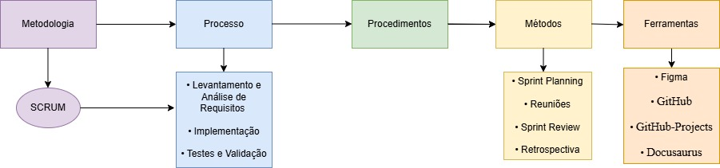

# Visão geral do projeto

## Ciclo de vida do projeto de desenvolvimento de software
- ### Metodologia 
    Nosso ciclo de vida adota uma abordagem iterativa e incremental, estruturada em níveis conceituais que orientam o desenvolvimento do projeto, conforme apresentado na Figura 2. Esses níveis se desdobram da filosofia metodológica adotada até as ferramentas utilizadas para operacionalizar as atividades.
    A base da nossa estrutura está na metodologia ágil SCRUM, que guia o processo de desenvolvimento em ciclos curtos e adaptativos, incentivando a entrega contínua de valor e a colaboração entre os membros do time.
    Com base nessa metodologia, definimos um processo composto pelas etapas de levantamento e análise de requisitos, implementação e testes, garantindo que o produto seja construído de forma incremental e validado continuamente. Cada uma dessas etapas é operacionalizada por procedimentos padronizados, que descrevem como cada fase deve ser conduzida.
    Esses procedimentos, por sua vez, são apoiados por métodos (como Sprint Planning, reuniões, revisões e retrospectivas) e ferramentas específicas (como Figma, GitHub, GitHub Projects e Docusaurus), que possibilitam a execução prática e o monitoramento das atividades. Essa integração de elementos assegura consistência, qualidade e rastreabilidade no desenvolvimento do produto.  
    A seguir, a [Figura 2](#figura-2) ilustra essa estrutura de forma esquemática, evidenciando a relação entre metodologia, processo, procedimentos, métodos e ferramentas adotadas no projeto.  
    
      
    *Figura 2: Diagrama de métodos.*
    
    *Fonte: De autoria própria.*

- ### Processos 
    **Processo (Conjunto de Atividades):** Com base na metodologia SCRUM, estruturamos um processo que abrange todas as fases essenciais do desenvolvimento do software. No nosso caso, o processo é composto pelas seguintes etapas:
    - **Levantamento e Análise de Requisitos:** Identificação das necessidades dos usuários e definição das funcionalidades do website.
    - **Projeto e Design do Sistema:** Criação da arquitetura do sistema, elaboração de wireframes, definição das tecnologias (HTML, CSS, Tailwind, JavaScript e MySQL).
    - **Implementação:** Codificação das funcionalidades tanto no front-end quanto no back-end, com integração contínua.
    - **Testes e Validação:** Execução de testes unitários, de integração e usabilidade para garantir a qualidade do sistema.
    - **Procedimentos (Guia o Modo de Fazer):** Para cada atividade do processo, desenvolvemos procedimentos que padronizam a execução. Por exemplo:  
        No design, há um procedimento para a elaboração de wireframes e protótipos com ferramentas de design (como Figma ou Sketch).  
        Durante a implementação, definimos padrões de codificação, revisão de código e integração contínua.  
        Para os testes, aplicamos um protocolo que guia a criação e execução de testes unitários, de integração e de usabilidade, conforme detalhado no tópico 7 (TESTES DE SOFTWARE). Esse protocolo inclui:
        - Análise estática de código com SonarQube para identificar vulnerabilidades (Seção 7.2).
        - Testes unitários com Jest e React Testing Library (Seção 7.2).
        - Testes de integração de APIs usando Supertest.
        - Testes end-to-end com Cypress para validar fluxos completos.
        Além disso, seguimos os critérios de entrada e saída definidos na Seção 7.3, garantindo que os testes só sejam iniciados após a aprovação do código-fonte e concluídos apenas quando 100% dos casos de teste forem executados e a cobertura mínima (80%) for atingida.  
        Esses procedimentos garantem que todos os membros da equipe saibam exatamente como proceder em cada etapa do projeto, mantendo consistência e qualidade.

- ### Métodos e Ferramentas
    **Métodos e Ferramentas (Técnica Formal e Instrumento para Realizar uma Tarefa):** Os procedimentos definidos são suportados por métodos e ferramentas específicas, que tornam a execução prática possível e mensurável.
    - **Métodos:**
        - Sprint Planning: Definição de tarefas no GitHub-Pages (Quadro Kanban)
        - Reuniões Diárias (Daily): Reuniões rápidas via Microsoft Teams, fase de desenvolvimento e testes. 
        - Sprint Review: Demonstração de funcionalidade para validação.
        - Retrospectiva: Análise de melhorias/implementações do processo.
    - **Ferramentas:** 
        - Figma: Protótipos visuais (Wireframes)
        - GitHub: Repositório contendo as implementações contínuas do projeto, verificações para garantir a segurança do projeto.
        - GitHub-Projects: Quadro Kanban, contendo as histórias de usuário e suas especificações, possibilitando a metodologia SCRUM
        - Docusaurus: Ferramenta de documentação, será utilizada para documentar o nosso progresso, atas de reuniões e entre outros

## Organização do Projeto
- A organização do projeto foi estruturada com base nos princípios da metodologia SCRUM, contemplando diferentes papéis funcionais e suas respectivas atribuições, conforme apresentado na Tabela 5 – Organização do projeto.
Cada integrante foi alocado de acordo com suas habilidades técnicas, preferências e disponibilidade, visando garantir a eficiência no desenvolvimento e a qualidade do produto. Embora existam papéis bem definidos, a equipe adota uma abordagem colaborativa, permitindo que membros atuem em múltiplas funções ou assumam atribuições complementares, sempre que necessário.
Além dos papéis técnicos, o projeto conta com a função de Scrum Master, exercida por Gabriel Augusto, cuja responsabilidade é facilitar os processos ágeis, remover impedimentos e promover a boa comunicação entre os membros da equipe.  

*Tabela 5: Declaração de posição do produto*
| Papel                  | Atribuições                                                                                                      | Responsável      | Participantes                                                                 |
|------------------------|------------------------------------------------------------------------------------------------------------------|------------------|-------------------------------------------------------------------------------|
| Desenvolvedor Backend  | Implementar e manter a lógica de servidor, criar APIs e garantir a integração com o Banco de Dados.              | Diogo Oliveira   | Gabriel Augusto, Rafael Siqueira, Diogo Oliveira, João Victor, João Pedro     |
| Desenvolvedor Frontend | Desenvolver as interfaces e interações do usuário, aplicar HTML, CSS, Tailwind e JavaScript para assegurar design responsivo e boa experiência. | Gabriel Augusto  | Caua Nicolas, Tiago Scherrer, Arthur de Lima, Gabriel Augusto                 |
| Responsável pela Documentação | Elaborar e manter a documentação técnica e de usuário, registrando decisões e atualizações do projeto.          | Diogo Oliveira   | Rafael Siqueira, Julia Oliveira, Gabriel Augusto, Gabriel Pereira, Diogo Oliveira |
| Banco de Dados         | Modelar, implementar e otimizar o banco de dados, garantindo segurança e desempenho.                             | João Victor      | João Victor, João Pedro, Ana Beatriz                                          |
| Analista de Testes     | Planejar e executar testes (unitários, de integração e de usabilidade), realizar refatorações e validar se os critérios de “pronto” são atendidos. | Rafael Siqueira | Rafael Siqueira, Julia Oliveira                                               |
| Dono do Produto        | Atualizar e gerir o escopo do produto, organizar o planejamento das sprints e validar as entregas, garantindo alinhamento com as necessidades demandadas. | Gabriel Augusto | Gabriel Augusto, Diogo Oliveira                                               |
| Cliente               | Fornecer feedback constante, validar funcionalidades e orientar as prioridades com base em suas necessidades.    | Gabriel Augusto | Gabriel Augusto                                                               |
| Scrum Master          | Facilitar as cerimônias ágeis, garantir a aplicação do framework SCRUM, remover impedimentos e promover a comunicação eficiente entre os membros da equipe. | Gabriel Augusto | Gabriel Augusto                                                               |

*Fonte: De autoria própria.*

## Planejamento das Fases
- **Planejamento das Fases e/ou Iterações do Projeto:** O planejamento do projeto foi organizado em sprints semanais, de acordo com os princípios da metodologia ágil SCRUM, visando entregas incrementais e interativas ao longo do ciclo de desenvolvimento. Cada sprint compreende um intervalo de tempo fixo com objetivos específicos, contendo um conjunto de tarefas (issues) atribuídas ao time de desenvolvimento.  
A Tabela 6 – Planejamento das Fases e/ou Interações do Projeto apresenta uma visão consolidada das sete sprints executadas, informando a data de início e fim de cada uma, os produtos entregues de forma resumida, os principais entregáveis (itens a serem entregues na sprint), os responsáveis envolvidos e o percentual de conclusão (%). É importante ressaltar que, embora os prazos tenham sido ajustados ao longo do tempo, todas as entregas foram efetivamente concluídas, resultando em 100% de conclusão por sprint. As entregas foram realizadas de forma colaborativa por todos os integrantes do grupo, o que reforça o caráter multidisciplinar da equipe. A atuação coletiva também foi essencial para garantir o cumprimento dos objetivos estabelecidos em cada sprint.  
Para uma visão mais detalhada dos entregáveis, com suas respectivas descrições e priorizações, recomenda-se a consulta à Tabela 10 – Backlog do produto, onde estão listadas as funcionalidades planejadas ao longo do projeto, organizadas com base nas tags de priorização, como “Must”, “Should” e “Could”.

*Tabela 6: Planejamento das Fases e/ou Interações do Projeto*
| Sprint__   | Data Início | Data Fim | Produto (Entrega)                          | Entregável(eis)                        | Responsáveis        | %    |
|-----------|-------------|----------|--------------------------------------------|----------------------------------------|---------------------|------|
| Sprint 1  | 17/05       | 20/05    | Interface inicial + autenticação + CI      | 1, 2, 3                               | Todos os integrantes | 100% |
| Sprint 2  | 20/05       | 27/05    | Cadastro de perfis + backend inicial       | 4, 5, 6                               | Todos os integrantes | 100% |
| Sprint 3  | 27/05       | 03/06    | Funcionalidades de chat e organização      | 7, 8, 9                               | Todos os integrantes | 100% |
| Sprint 4  | 03/06       | 09/06    | Página de upload e gestão de contratos     | 10, 11, 12, 13                        | Todos os integrantes | 100% |
| Sprint 5  | 09/06       | 16/06    | Filtros de busca + otimização UI           | 14, 15, 16, 17, 18, 19, 20           | Todos os integrantes | 100% |
| Sprint 6  | 16/06       | 23/06    | Relatório de métricas + ajustes backend    | 21, 22, 23, 24, 25, 26, 27, 28, 29, 30, 31 | Todos os integrantes | 100% |
| Sprint 7  | 23/06       | 30/06    | Deploy e refinamentos finais               | 31, 32, 33, 34, 35, 36, 37, 38, 39, 40 | Todos os integrantes | 100% |
| Sprint 8  | 30/06       | 07/07    |                                            |                                        | Todos os integrantes |      |

*Fonte: De autoria própria.*

## Matriz de Comunicação
- **Matriz de Comunicação:** Esta seção descreve a estratégia adotada para monitorar o progresso do projeto, detalhando quem se comunica, com que frequência, por onde e quais produtos (documentos) são gerados. No nosso caso, utilizamos o Microsoft Teams para centralizar as comunicações, realizando reuniões fixas às segundas e quartas-feiras, além de um encontro extra semanal (“quando necessário”), para discutir aspectos específicos do projeto, algumas vezes entre todos os integrantes e outras com parte específica de alguma função. Essas informações estão organizadas na Tabela 7, que apresenta a matriz de comunicação, detalhando a descrição da comunicação, os envolvidos, a periodicidade e os produtos gerados.

*Tabela 7: Matriz de comunicação.*

| Descrição | Área/Envolvidos | Periodicidade | Produtos Gerados |
|-----------|-----------------|--------------|------------------|
| Acompanhamento Geral do Projeto. Acompanhamento dos riscos e ações pendentes. | Equipe do Projeto. | Reuniões via Microsoft Teams: Segundas e Quartas-feiras, com uma reunião adicional semanal para discussões gerais e/ou específicas. | Ata de reunião. Relatório de situação do projeto. |
| Comunicação da situação do projeto. | Equipe. Professor/Monitor. | Não definida. | Ata de reunião, e Relatório de situação do projeto. |

*Fonte: De autoria própria.*

## Gerenciamento de Riscos

- **Gerenciamento de Riscos:** O Gerenciamento de Riscos tem como objetivo identificar, analisar e gerenciar os possíveis riscos que podem impactar o sucesso do projeto. A cada ciclo (ou iteração) do projeto, a lista de riscos deverá ser revisada para garantir que os riscos estejam atualizados e que novas ações de mitigação ou contingência sejam implementadas quando necessário. Esses aspectos estão sistematizados no Quadro de Gerenciamento de Riscos, apresentado na Tabela 8, o qual contempla os riscos identificados, seu grau de exposição, as ações de mitigação e os respectivos planos de contingência.
- **Considerações:**
    - **Grau de Exposição:** Classificar o risco como "Alto", "Médio" ou "Baixo" ajuda a priorizar as ações preventivas e definir se o risco necessita de um plano de contingência robusto.
    - **Ação de Mitigação:** São medidas que podem reduzir ou eliminar a probabilidade ou o impacto dos riscos. A aplicação dessas ações deve ser planejada e registrada desde a fase de início do projeto.
    - **Plano de Contingência:** Caso um risco se concretize, o plano de contingência indica as ações imediatas a serem tomadas para minimizar os danos ou recuperar o andamento planejado do projeto.

*Tabela 8: Quadro de gerenciamento de Riscos.*

| Risco | Grau de exposição | Ação de Mitigação | Plano de Contingência |
|-------|------------------|------------------|----------------------|
| Atrasos no cronograma do projeto. | Alto. | Revisão e replanejamento contínuo; realocação de recursos; reuniões de acompanhamento frequentes. | Convocação imediata de uma reunião de replanejamento e revisão de escopo; ajustes de prazos e redefinição de prioridades. |
| Falhas na integração do sistema. | Médio. | Realização de testes unitários e de integração com maior rigor; validação contínua das interfaces desenvolvidas. | Atuação imediata da equipe de desenvolvimento para sanar a falha. |

*Fonte: De autoria própria.*

## Critérios de Replanejamento
- **Integração com a Gestão de Riscos:** Os critérios de replanejamento estão intimamente ligados à gestão de riscos. É essencial manter a atualização constante da lista de riscos, pois os riscos materializados ou novos riscos identificados serão fontes críticas para a decisão de replanejar. Essa lógica está apresentada no Quadro dos Critérios de Replanejamento, conforme descrito na Tabela 9.
- **Atualização Contínua:** Os critérios e procedimentos de replanejamento devem ser revisados e, se necessário, ajustados a cada ciclo de desenvolvimento para refletir a realidade atual do projeto. Cada mudança que desencadear um replanejamento deve ser registrada, garantindo o versionamento deste documento.
- **Decisão Baseada em Dados:** O replanejamento deve ser acionado com base em indicadores claros de desempenho, no impacto dos riscos concretizados e nas alterações significativas de escopo, evitando mudanças excessivas que possam comprometer a estabilidade do projeto.  
Tais indicadores estão organizados na Tabela 13: Métricas e Medições, que reúne métricas essenciais para avaliar a performance de um time ágil, como **Velocidade da Sprint, Desvio de Cronograma, Tempo Médio de Resolução, Precisão das Estimativas e Taxa de Retrabalho.**  
Essas métricas possibilitam análises objetivas sobre a qualidade do planejamento, a eficiência da equipe e os pontos de melhoria. Além disso, são acompanhadas em tabelas específicas por Sprint, as quais complementam a análise contínua com base nos critérios definidos na Tabela 14.

*Tabela 9: Quadro dos critérios de replanejamento.*

| Critérios | Ação |
|-----------|------|
| Conflitos Internos na Equipe | Quando surgirem divergências significativas entre os membros da equipe, pode ser necessário reavaliar e ajustar certos pontos do projeto. Essas discordâncias podem levar à necessidade de reestruturar composição de times ou refazer trechos do produto, garantindo a integração e a eficácia das contribuições. Nessas situações, o conflito será conduzido por uma mediação utilizando os princípios da Comunicação Não Violenta (CNV), com o objetivo de restaurar a harmonia e fortalecer a colaboração entre todos os envolvidos. |
| Indicadores de Desempenho Insatisfatórios | Caso os indicadores-chave de desempenho (qualidade, entregas parciais, feedback dos usuários) não atinjam as metas estabelecidas no planejamento, será necessário revisar os processos e ajustar as estratégias para recuperar o caminho planejado. |
| Desvios Significativos no Cronograma | Se o andamento das atividades apresentar atrasos que ultrapassem um percentual crítico, o projeto deverá ser reavaliado para realinhar prazos e recursos. Essa condição é aplicada quando os atrasos impactam marcos ou entregáveis críticos do projeto. |
| Materialização de Riscos Críticos | Quando um dos riscos identificados na matriz de riscos, especialmente aqueles com alto grau de impacto, se concretizar e afetar os resultados ou a continuidade das atividades, o planejamento deverá ser revisado conforme os planos de mitigação ou contingência previstos. |

*Fonte: De autoria própria.*

---

## Referência
### Documento de visão do produto e do projeto
Para acessar a versão mais atual (v1.2.0) do documento de visão do produto e do projeto, consulte o pdf  
[Visão do Produto e do Projeto - EcoNet](../../static/files/visao-do-produto-e-do-projeto-algiz-2025.1.pdf)

