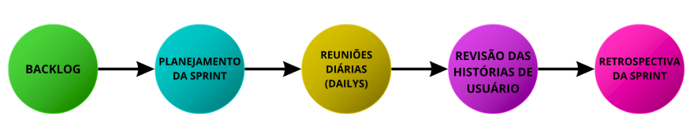

# Ciclo de vida do projeto

|              | **Descrição**                                                                                                                                                                                                                                                                                                                                                            |
|--------------|----------------------------------------------------------------------------------------------------------------------------------------------------------------------------------------------------------------------------------------------------------------------------------------------------------------------------------------------------------------------|
|**Metodologia:**  | Esta é a base teórica que norteia nossas decisões. Escolhemos a metodologia SCRUM, uma abordagem ágil, que valoriza a flexibilidade, a colaboração contínua e a entrega incremental. Essa escolha filosófica suporta a escolha do processo a ser adotado, pois define a forma como lidamos com a incerteza e as mudanças de requisitos. |
|**Procedimento:** | Para cada atividade do processo, desenvolvemos procedimentos que padronizam a execução. Por exemplo:   • No design, há um procedimento para a elaboração de wireframes e protótipos com ferramentas de design (como Figma ou Sketch).  • Durante a implementação, definimos padrões de codificação, revisão de código e integração contínua. Para os testes, aplicamos um protocolo que guia a criação e execução de testes unitários e de integração.  • Esses procedimentos garantem que todos os membros da equipe saibam exatamente como proceder em cada etapa do projeto, mantendo consistência e qualidade. | 
|**Processo:**     | Com base na metodologia SCRUM, estruturamos um processo que abrange todas as fases essenciais do desenvolvimento do software. No nosso caso, o processo é composto pelas seguintes etapas:   • Levantamento e Análise de Requisitos: Identificação das necessidades dos usuários e definição das funcionalidades do website.  • Projeto e Design do Sistema: Criação da arquitetura do sistema, elaboração de wireframes, definição das tecnologias (HTML, CSS, Tailwind, JavaScript e MySQL).  • Implementação: Codificação das funcionalidades tanto no front-end quanto no back-end, com integração contínua.  • Testes e Validação: Execução de testes unitários, de integração e usabilidade para garantir a qualidade do sistema.  • Manutenção e Evolução: Monitoramento, correções e incorporações de melhorias conforme feedback dos usuários.  Essa sequência de atividades é orientada por procedimentos que definem, de forma prática, como cada fase deve ser executada. |
|**Ferramentas:**  | • Figma: Protótipos visuais (Wireframes)  • GitHub: Repositório contendo as implementações contínuas do projeto, verificações para garantir a segurança do projeto.  • GitHub-Projects: Quadro Kanban, contendo as histórias de usuário e suas especificações, possibilitando a metodologia SCRUM   • Docusaurus: Ferramenta de documentação, será utilizada para documentar o nosso progresso, atas de reuniões e entre outros |
|**Métodos:**      | • Sprint Planning: Definição de tarefas no GitHub-Pages (Quadro Kanban).  • Reuniões Diárias (Dailys): Reuniões rápidas via Microsoft Teams, fase de desenvolvimento e testes.  • Sprint Review: Demonstração de funcionalidade para validação.  • Retrospectiva: Análise de melhorias/implementações do processo |

*Representação gráfica do ciclo de vida do projeto.*
                                                                                                                                                                                                                                                                                                                                            